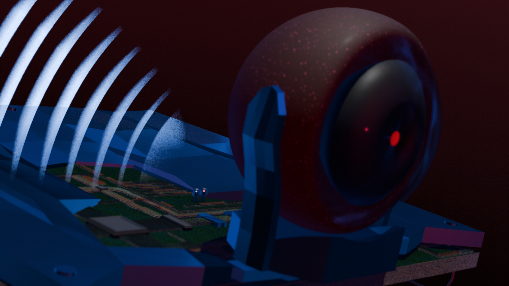
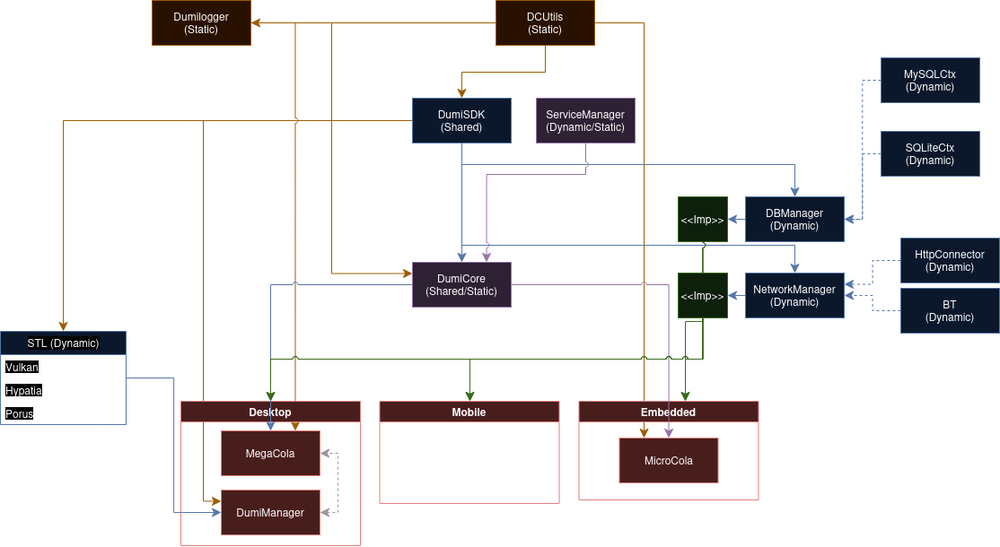

# Dumicola
A networked device control hub for tinkerers. Dumicola provides a managed way to connect devices, provide utilites to create custom programs to automate signaling between devices on your Dumicola network, and create your own libraries and plugins to fully customize your network.

### Use Cases
###### Robotics / Embedded Systems
* Run Microcola on embedded systems to enable interoperability to mobile and desktop environments
* Standardize comunication between robots and other embedded solutions 
###### Home Security
* Stream camera feeds across devices
* Create networked motion sensors
* Broadcast alarms to mobile devices
###### Hobby Projects
* Pretty much any involving computers and networks, really.

## Getting Started

## Connecting Devices

## Basic Programs

## Custom Plugins

## Standard Libraries (CoLib)
* Vulkan (Logic)
* Hypatia (Math)
* Porus (Data Provider)

# Components
### DumiSDK
Provides common definitions used across Dumicola components. This includes system type definitions and handling, as well as the base definitions required to create plugin libraries, as well as services used by the Service Manager.

### Service Manager
The service manager provides a configurable system for injecting services and making them available across the Dumicola system. Examples of services include database providers, network communication, and file access.

### DumiCore
This is the base runtime library used for creating a Dumicola executable. This provides a base implementation of all universally required systems, which can be extended for a final target, such as for a desktop or embedded implementation. As such, this is lightweight and does not directly provide platform specific configuration.

### DumiMobile
The mobile (Android) implementation of DumiCore. This provides the basic runtime environment behind the Android application UI. This version adds Bluetooth and Wifi communication, as well as basic file access.

### DumiMicro
The embedded implementation of DumiCore. Being the most lightweight of the deployable systems, this implementation does not provide much configuration out of the box, as resources are expected to be scarce, and available peripherals are unknown. These will need to be added by the developer.

### DumiDesktop
Dumidesktop is the fully configured environment for running Dumicola on PC. This includes full network configuration, a graphical interface, broader file access, and more. It is recommended to have at least one DumiDesktop instance available to lighten the network load on less powerful devices, although this is not required.

# Roadmap

Project | Status | Progress | Active
--------|--------|----------|-------
| DumiSdk | Started |  | Yes 
| Data Manager | Started |  | Yes 
| Service Manager | Paused |  | Yes 
| Library Manager | Started |  | Yes 
| App Runner | Paused |  | Yes 
| DumiCore | Started |  | Yes 
| DumiMobile | Started |  | Yes 
| DumiMicro | Not Started |  | No 
| DumiDesktop | Pause |  | Yes 

# Auxiliary Projects
Project | Status  | Active
--------|--------|-------
| DCUtils | Ongoing | Yes
| DumiLogger | Ongoing | Yes

# Standard Libraries
Plugin | Status | Progress | Active
------ | ------ | -------- | ------
| Vulkan (STL) | Started |  | Yes 
| Hypatia (STL) | Not Started |  | Yes 
| Porus (STL) | Not Started |  | Yes 

# User Interfaces
GUI | Platform | Status | Progress | Active
--- | -------- | ------ | -------- | ------
| Terminal | Windows/Linux | Not Started |  | Yes
| WinUI | Windows | Not Started |  | No
| GNUI | Linux | Not Started |  | No

###### Current architecture