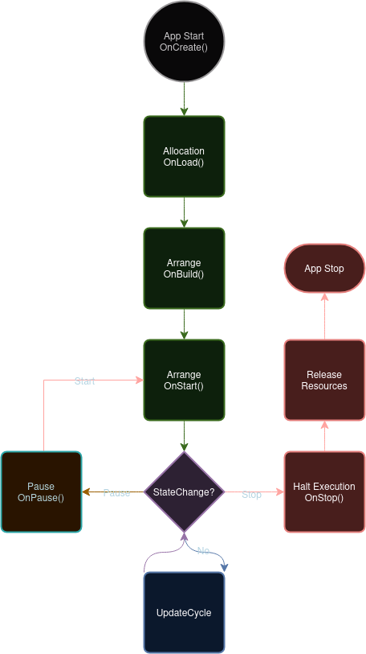

# App Runner
The App Runner provides the means to execute Dumicola applications. This layer handles memory management, as well as processing structure and coordination.

The App Runner acts as a service, and handles the execution of applications during the Dumicola lifecycle. The runner may handle as many applications as resources allow, and is configurable depending on the platform requirements.

## Concurrency
Applications may be run in Multiprocessing mode to take advantage of multiple cores if possible, or under a thread pool for single core execution.

## Memory Management
Each application shares a single DataManager instance, although this is likely to change in the future. As such, threaded/mulitprocess configurations currently require Dumicore to be compiled with -DCORE_UTIL=N, where:
* N = 0: Max available cores
* N = 1: Single thread mode
* N > 1: Dumicore will attempt to optimize utilization of the given number of cores, so long as the number does not exceed available logical cores. 

### Lifecycle
