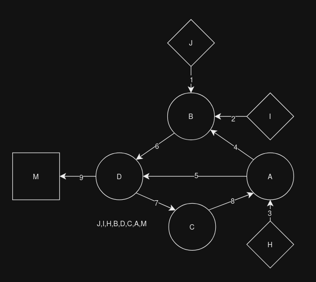
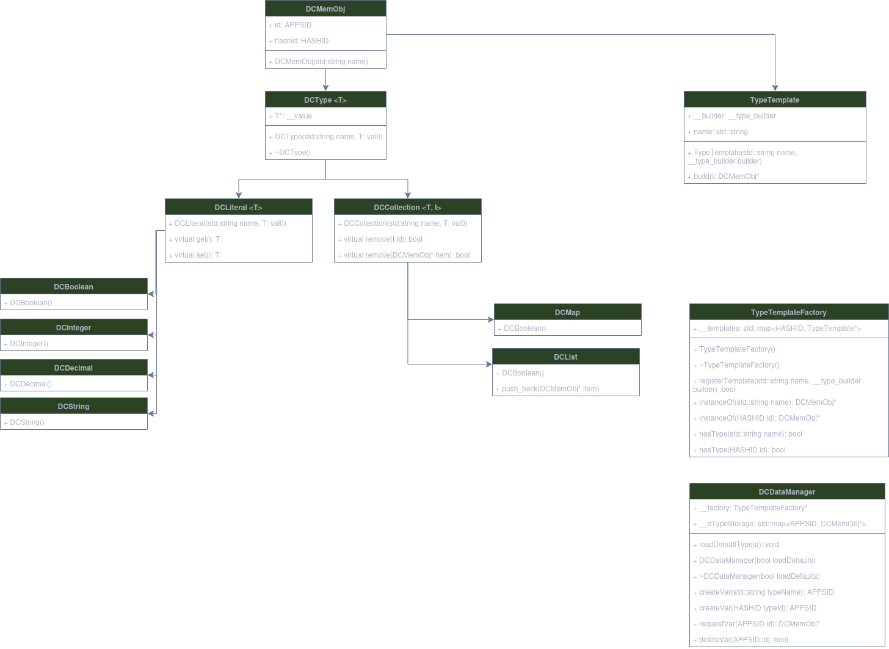

# DumiSDK

The Dumicola SDK provides the core definitions used across the Dumicola environment. This provides the required interfaces and data structures required to create custom Dumicola components. Currently, these exist as **DCType** defintions for Dumicola's managed data system, the **DCPlugin** structures for creating component libraries, **DCApp** for Dumicola programs, and the **DCService** structures for injecting system services to run on the Dumicola runtime.

## DCTypes
Below are the data types native to the Dumicola environment. These are used by user defined programs to transfer, compute and store information between program nodes.

Name | Description
---- | -----------
INTEGER | A signed integer (max bus size)
DECIMAL | A floating point decimal (max bus size)
BOOL | Boolean true or false
STRING | Mutable string
LIST | A collection of values
MAP | A dictionary of values
MMDT | Multi-media data type


## DCPlugin
The base definitions to create component libraries. These are first defined as **Templates** which are registered to a **Library**. When invoked from the Dumicola system, these templates create a concreate instance of the template called a **Node** with it's given configuration. 

Libraries are collections of templates which can be loaded at runtime. As DLL's, they may also be shared across devices (when/if decided how to make that concept less risky). 

#### Libraries
Libraries provide node instances upon request. Each library is contained within a single shared library, such as a .so or .dll. Libraries contain some meta data, including their name, author, repository address, version, and description. 

The runtime first requests a list of available templates from the library, and then may request the library to produce a node based on the template id.

###### Library API
| Method | Type | Arguments |
| ------ | ---- | --------- |
| ListCatalog | ```std::vector<std::tuple<std::string, APPSID>>``` | 
| GetInstance | T* | APPSID templateId

#### Templates
Template are the blueprints used to define a node. Here, multiple configurations are possible to create a node designed for a specific purpose. Templates and nodes share a common set of traits, as templates are effectively a factory for their respective node.

###### Template API
| Method | Type | Arguments
| ------ | ---- | ---------
| BuildNode | T* | 

#### Nodes
Nodes are runtime processing units that make up a Dumicola application. These are created from Templates provided by a Library. Nodes have three basic parts: **inputs**, **outputs**, and **fields**. These allow for the propogation and processing of data. 

Every program cycle, each node is **Updated**, or allowed to execute a method. These update methods are the heart of a node. It is here where the special logic of a node takes place, and where it can make use of it's inputs to do work.



###### DCNode API
| Method | Type | Arguments
| ------ | ---- | ---------
| GetInput | DCInput* | std::string name \| APPSID id
| GetOutput | DCOutput* | std::string name \| APPSID id
| GetView | DCView* | std::string name \| APPSID id
| GetField | DCField* | std::string name \| APPSID id
| Update | void | 

Nodes are separated into different categories depending on their characteristics as outlined in the table below.

:white_check_mark: - Expected :large_orange_diamond: - Optional :x: - Not Allowed

###### Node Types
| Type | Inputs | Outputs | Views
| ---- | ------ | ------- | -----
| Provider | :x: | :white_check_mark: | :x:
| Actuator | :white_check_mark: | :white_check_mark: | :large_orange_diamond: 
| Monitor | :white_check_mark: | :x: | :large_orange_diamond: 
| Single | :x: | :x: | :x: 
| Nomad | :x: | :white_check_mark: | :large_orange_diamond: 

**Inputs** are divided into two base types: **DCInput** and **DCView**.

##### Inputs / Views
DCInputs are fixed, named inputs. These are always expected to be present, and in a fixed order. 

DCViews on the other hand are dyanmically assigned. If a component is configured to have DCViews enabled, than views may be registered or removed during design time, but are static at runtime. DCView inherits DCInput.

In either case, the purpose of DCInput and DCView is to allow DCType propgation from a DCOutput, and make it's value visible to the DCNode.

###### DCInput API
| Method | Type | Arguments | Public
| ------ | ---- | --------- | ------
| Set | void | DCType*value | :x:
| Get | void | DCType*value | :white_check_mark:

###### DCView API
| Method | Type | Arguments | Public
| ------ | ---- | --------- | ------
| Set | void | DCType*value | :x:
| Get | void | DCType*value| :white_check_mark:

##### Outputs

Outputs are fixed, named outlets from a node. Outputs are responsible for providing a value to an input or view.

###### DCOutput API
| Method | Type | Arguments | Public
| ------ | ---- | --------- | ------
| Set | void | DCType*value | :white_check_mark:
| Get  | DCType*value | | :x:

**Fields**

Fields are values used to configure a node. These are effectively the visible 'state' of a node, and may be configured on design time. Each field represents on DCType value stored in a node. 

Note that not all states in a node are Fields; only those that can be configured from the designer are. Fields can not be changed during runtime by default, however a node may change its fields, such as if in response to input.

###### Field API
| Method | Type | Arguments | Public
| ------ | ---- | --------- | ------
| Set | void | DCType*value | :white_check_mark:
| Get | DCType* |  | :x:


#### DCApp
The DCApp or Dumicola Application is the engine that houses and runs an application. Here, a stored XML program is parsed and an in-memory scaffold is generated, depicting the node templates, inputs, outputs and views, and all of the connections between them. These templates are then constructed and linked into a managed network. 

Next, the network is processed to determine the order in which nodes are executed, and the order signals are propogated.

The program then runs, and may be paused, stopped, or restarted.



###### Current SDK Architecture


## Managed Memory

#### IDCFactoryStore
The IDCFactoryStore acts as the base memory organization and lifetime manager for Dumicola. Here, data instances and factories are stored by tag and id pairs. Tags are supplied by the implementation. Ids are TypeId's of the resulting object instance's address.

| Method | Type | Templates | Arguments
| ------ | ---- | --------- | ---------
| registerFactory | void | T, U, ... Args | int tag, std::function<U*(Args...)> builder
| createNew | T* | T, ... Args | int tag, bool save, void* args
| resolveAs | T* | T | int tag, APPSID id

* RegisterFactory: Accepts template parameters T (Base class (optional)), U (Derived class (or concrete if T is void)), and Args (variadic). Accepts arguments tag and builder. Tag is used to specify a group to store the factory in. Factory id's are TypeId's of T, or U if void. As such, factories are indexed as _factories[int][TypeId], allowing one TypeId per group. If U is specified through a base type T, only resolution through type T will instantiate U. If U is registered both alone and with T, two stored instance of U factories may exist; one invocable through T, and the other through U.

* CreateNew: Accepts templates T and Args. T must reflect the type T or U used as the TypeId with RegisterFactory. Values to Args are passed the registered factory. The tag parameter selects both a factory group to invoke from in conjunction with TypeId(T) to invoke a stored factory. Bool save determines whether the created instance is stored. In either case, a new unmanaged pointer is returned. If save is true, a copy of the pointer is also stored.

* ResolveAs: Accepts template T. Accepts parameters tag and id. Id may be determined after calling createNew by invoking appId(result), where result is the value returned by createNew. Returns stored instance.

When DCFactoryStore is destroyed, all allocated memory is freed.

Used by DataManager and ServiceManager.
